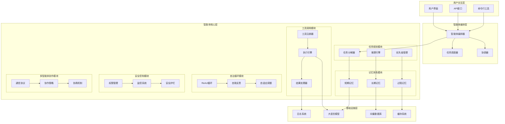
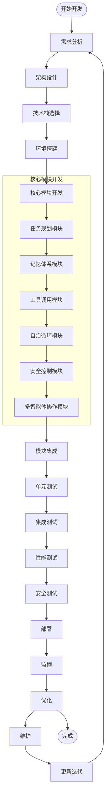
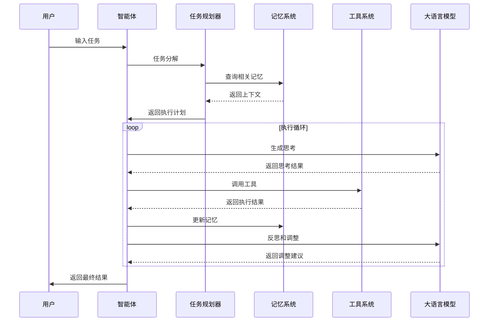
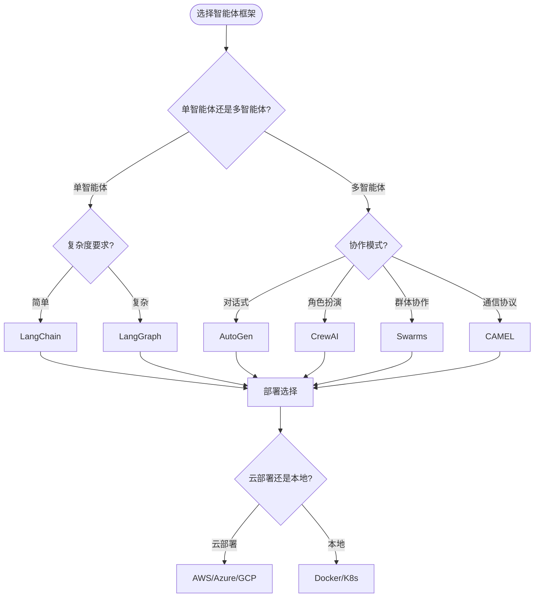
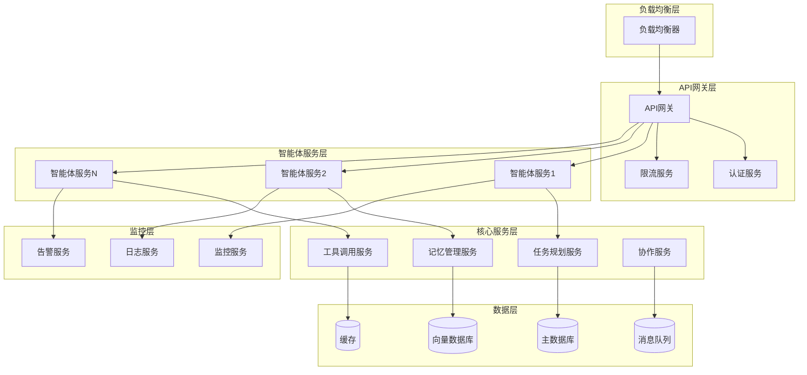
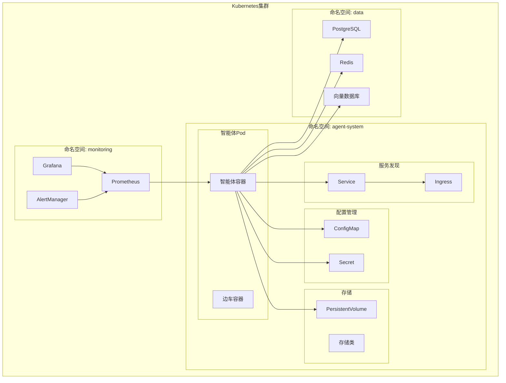

# AI智能体架构设计文档

> 基于六大核心技术支柱的智能体系统架构设计

## 📋 目录

1. [智能体架构概览](#智能体架构概览)
2. [核心组件架构图](#核心组件架构图)
3. [智能体开发流程图](#智能体开发流程图)
4. [技术栈选择指南](#技术栈选择指南)
5. [部署架构设计](#部署架构设计)

---

## 智能体架构概览

### 🏗️ 智能体系统架构层次

---

## 核心组件架构图

### 🧠 智能体核心架构

```mermaid
graph LR
    subgraph "智能体核心"
        subgraph "输入处理"
            INPUT[用户输入]
            PARSE[输入解析]
            VALIDATE[输入验证]
        end
        
        subgraph "任务规划引擎"
            DECOMPOSE[任务分解]
            REASONING[推理规划]
            SCHEDULING[任务调度]
        end
        
        subgraph "记忆管理"
            CONTEXT[上下文记忆]
            KNOWLEDGE[知识库]
            HISTORY[历史记录]
        end
        
        subgraph "工具执行"
            TOOL_SELECT[工具选择]
            TOOL_CALL[工具调用]
            RESULT_PROCESS[结果处理]
        end
        
        subgraph "决策循环"
            THINK[思考阶段]
            ACT[行动阶段]
            OBSERVE[观察阶段]
            REFLECT[反思阶段]
        end
        
        subgraph "输出生成"
            RESPONSE[响应生成]
            FORMAT[格式化]
            DELIVERY[输出交付]
        end
    end
    
    INPUT --> PARSE
    PARSE --> VALIDATE
    VALIDATE --> DECOMPOSE
    
    DECOMPOSE --> REASONING
    REASONING --> SCHEDULING
    
    SCHEDULING --> CONTEXT
    CONTEXT --> KNOWLEDGE
    KNOWLEDGE --> HISTORY
    
    HISTORY --> TOOL_SELECT
    TOOL_SELECT --> TOOL_CALL
    TOOL_CALL --> RESULT_PROCESS
    
    RESULT_PROCESS --> THINK
    THINK --> ACT
    ACT --> OBSERVE
    OBSERVE --> REFLECT
    
    REFLECT --> RESPONSE
    RESPONSE --> FORMAT
    FORMAT --> DELIVERY
```

---

## 智能体开发流程图

### 🔄 智能体开发生命周期

### 🎯 智能体执行流程图

---

## 技术栈选择指南

### 🛠️ 技术栈矩阵

| 组件 | 推荐技术栈 | 备选方案 | 适用场景 |
|------|------------|----------|----------|
| **前端框架** | React/Vue | Angular/Svelte | 可视化智能体界面 |
| **后端框架** | FastAPI/Flask | Django/Express | API服务开发 |
| **AI框架** | LangChain/LangGraph | LlamaIndex/Semantic Kernel | 智能体编排 |
| **多智能体** | CrewAI/AutoGen | CAMEL/Swarms | 多智能体协作 |
| **数据库** | PostgreSQL/MongoDB | Redis/Chroma | 数据存储 |
| **向量数据库** | Pinecone/Weaviate | Qdrant/Milvus | 向量搜索 |
| **消息队列** | Redis/RabbitMQ | Apache Kafka | 异步通信 |
| **监控** | Prometheus/Grafana | ELK Stack | 系统监控 |
| **部署** | Docker/Kubernetes | Docker Compose | 容器化部署 |

### 📊 框架选择决策树

---

## 部署架构设计

### 🏗️ 微服务架构

### 🐳 容器化部署

---

## 🎯 架构设计原则

### 1. 模块化设计
- 将智能体功能拆分为独立模块
- 使用接口和抽象类定义标准
- 保持模块间的松耦合

### 2. 可扩展性
- 支持水平扩展
- 实现负载均衡
- 使用消息队列解耦

### 3. 高可用性
- 实现故障转移
- 提供健康检查
- 支持自动重启

### 4. 安全性
- 实现权限管理
- 提供安全护栏
- 支持审计日志

### 5. 可观测性
- 集成监控系统
- 实现结构化日志
- 提供性能指标

---

*本架构设计基于对30+个开源智能体框架的深度分析，持续更新中。*
