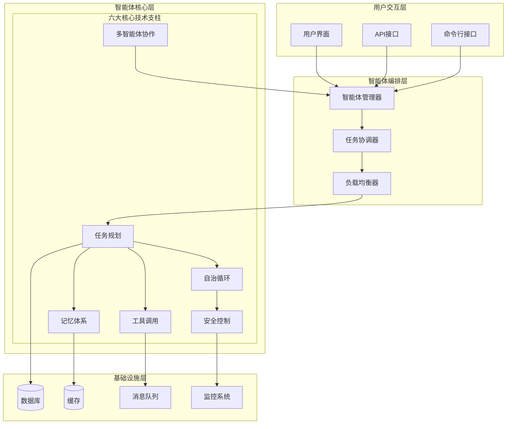
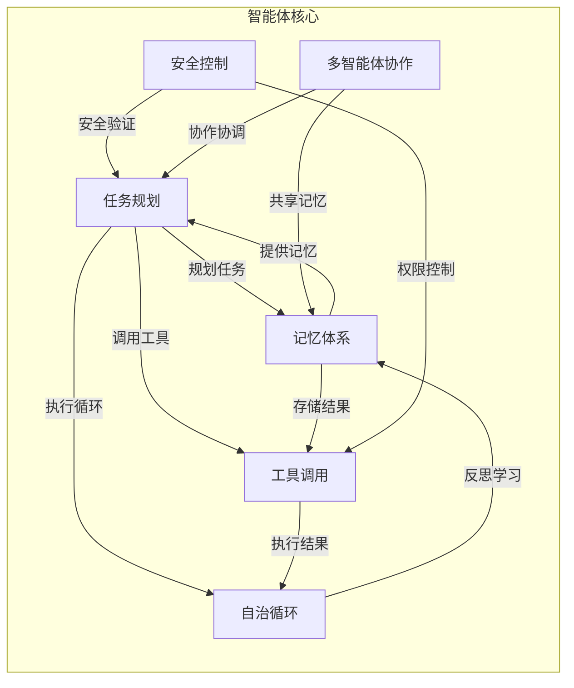
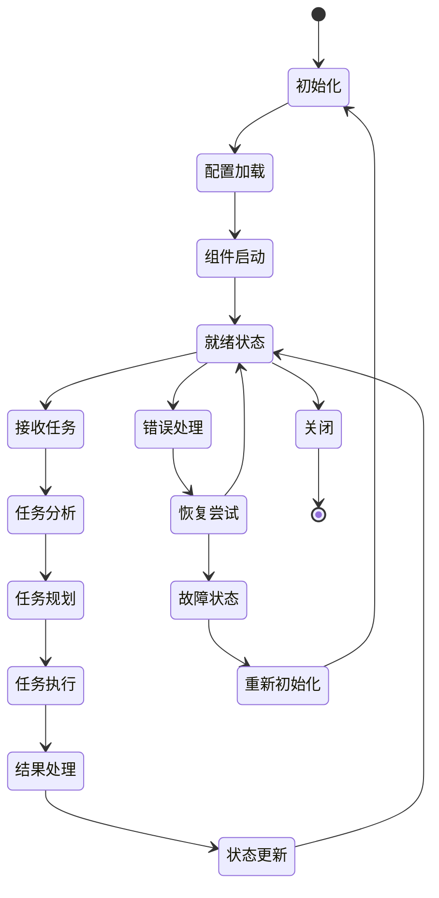
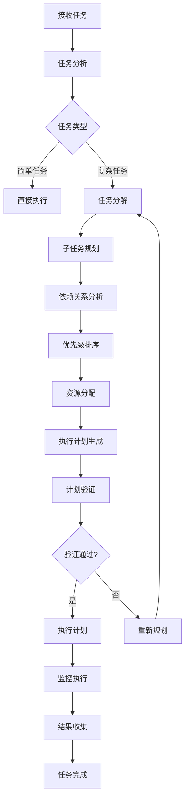
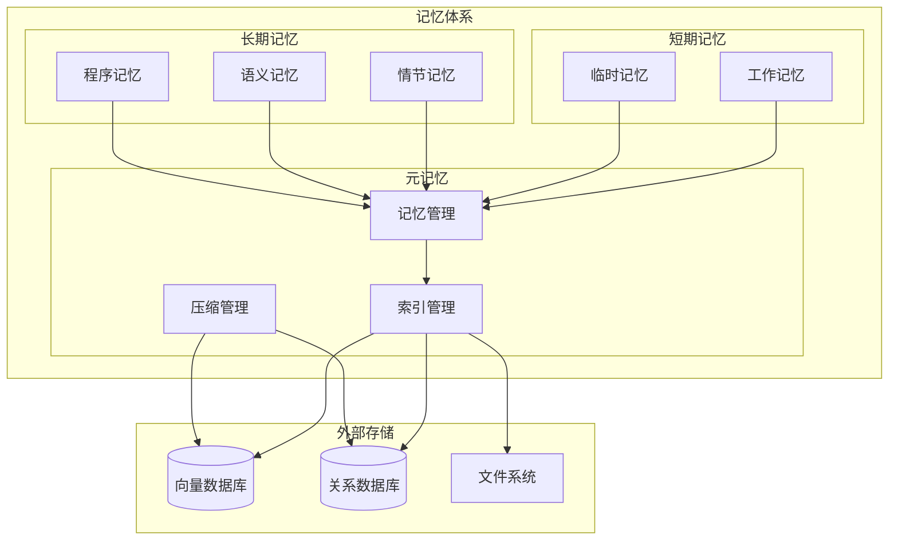
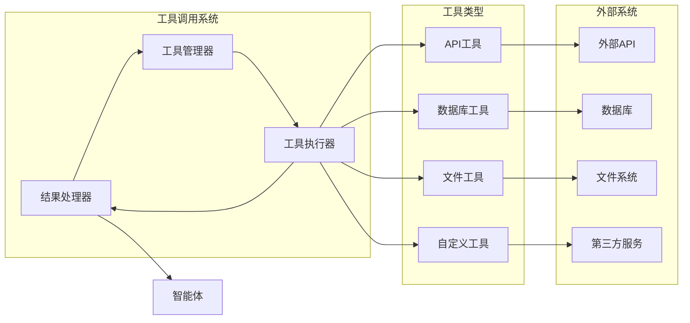
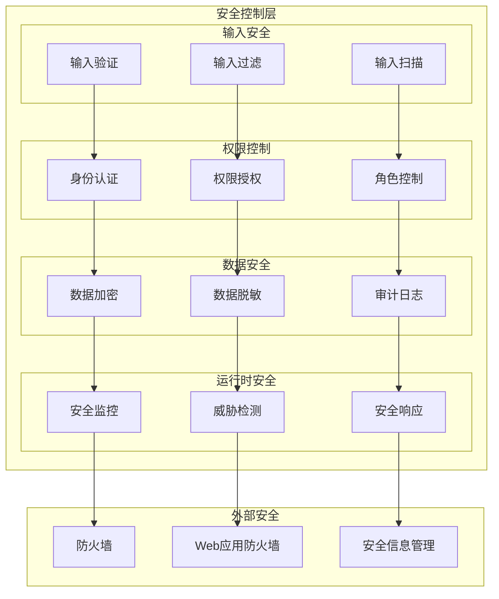
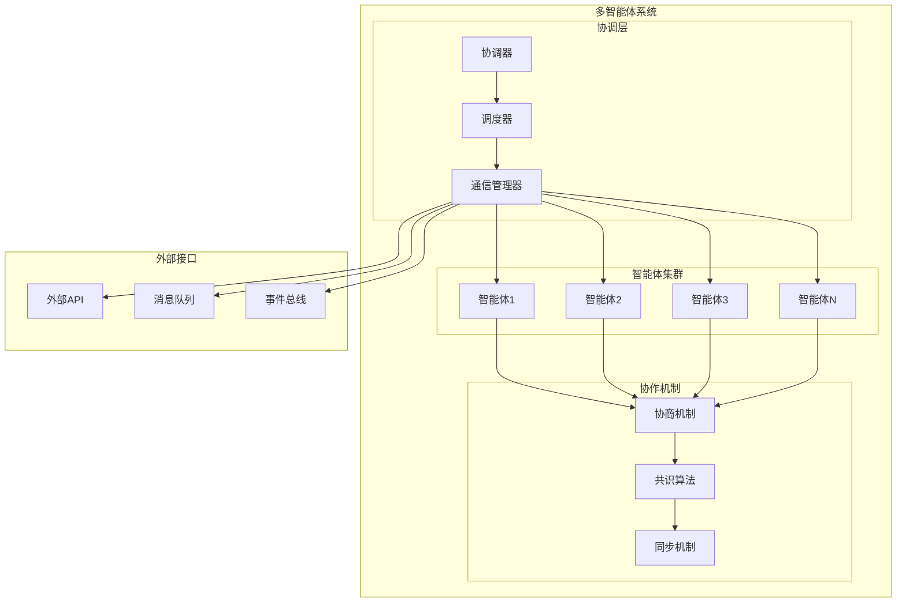
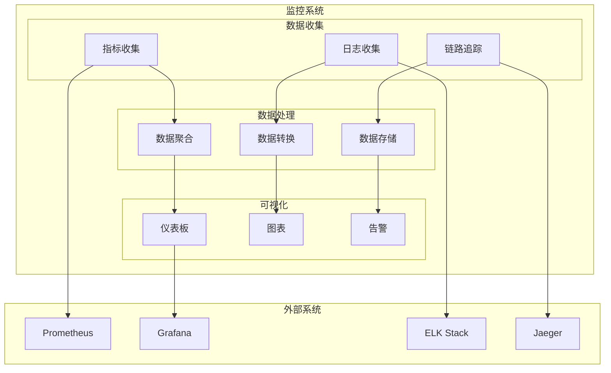
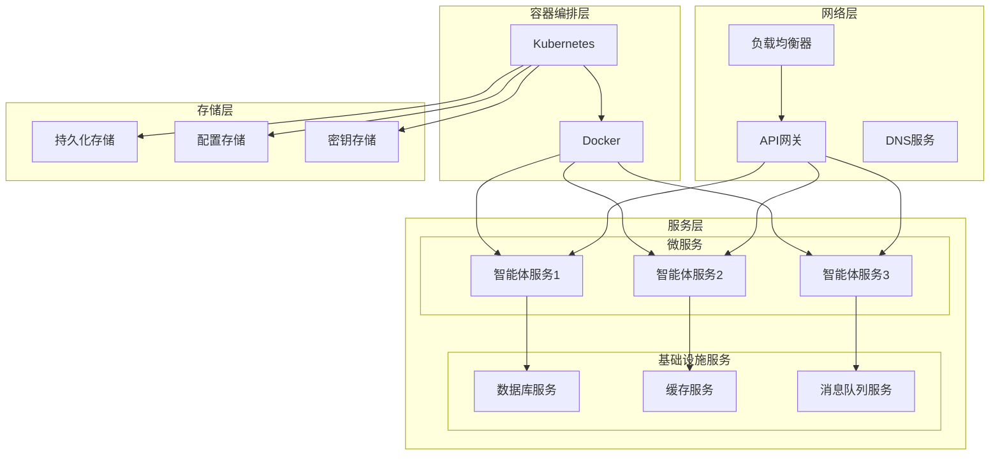

# 第1章 智能体架构设计原理 - 架构图

## 1. 智能体系统整体架构图

## 2. 六大核心技术支柱关系图

## 3. 智能体生命周期图

## 4. 任务规划流程图

## 5. 记忆体系架构图

## 6. 工具调用架构图

## 7. 安全控制架构图

## 8. 多智能体协作架构图

## 9. 性能监控架构图

## 10. 部署架构图

这些架构图展示了智能体系统的各个层面和组件之间的关系，帮助开发者更好地理解智能体的整体架构设计。
