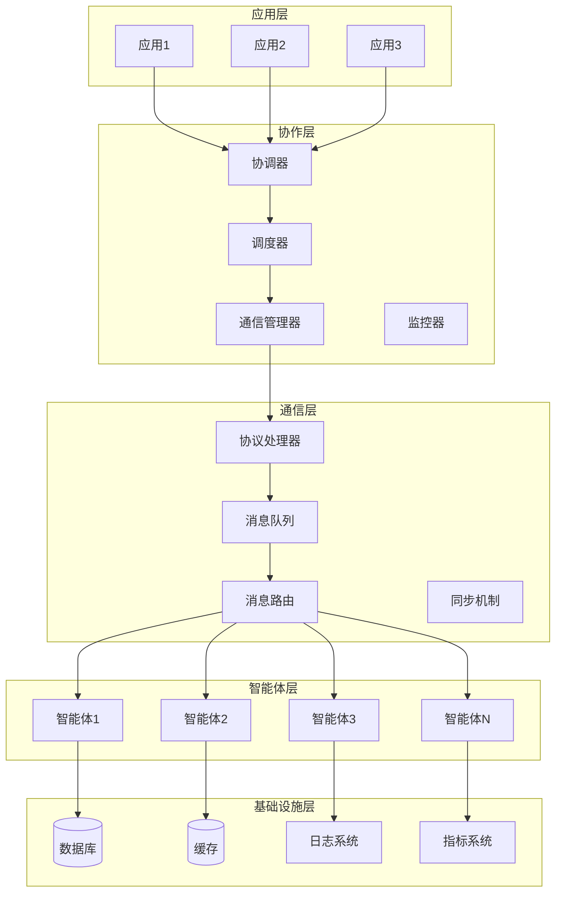
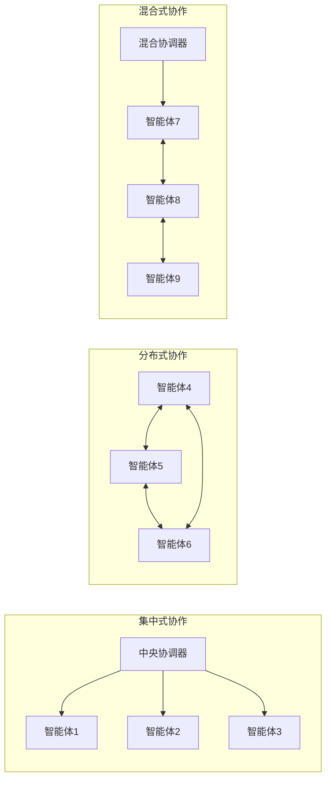
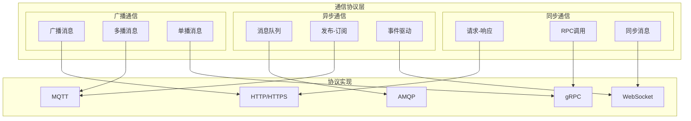
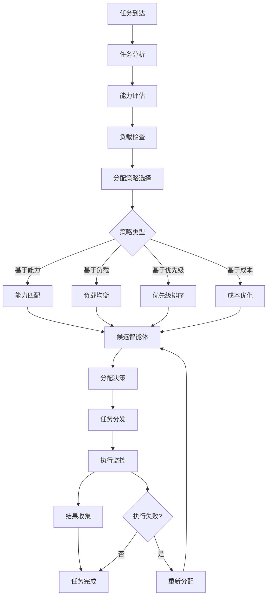
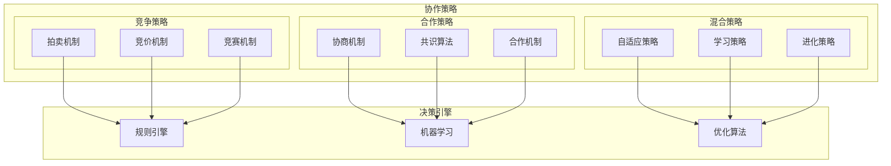
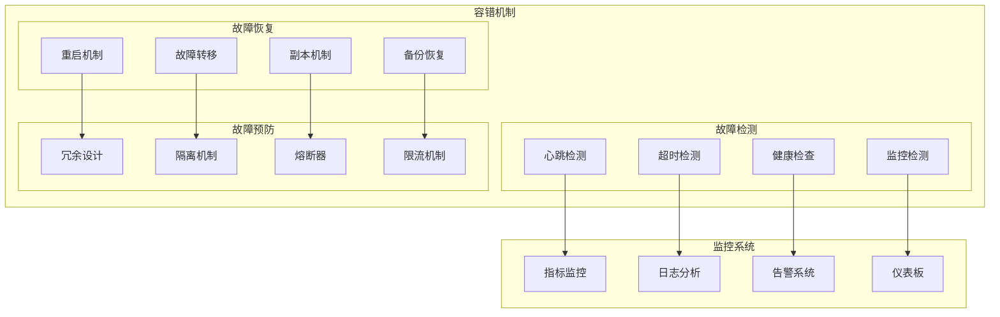
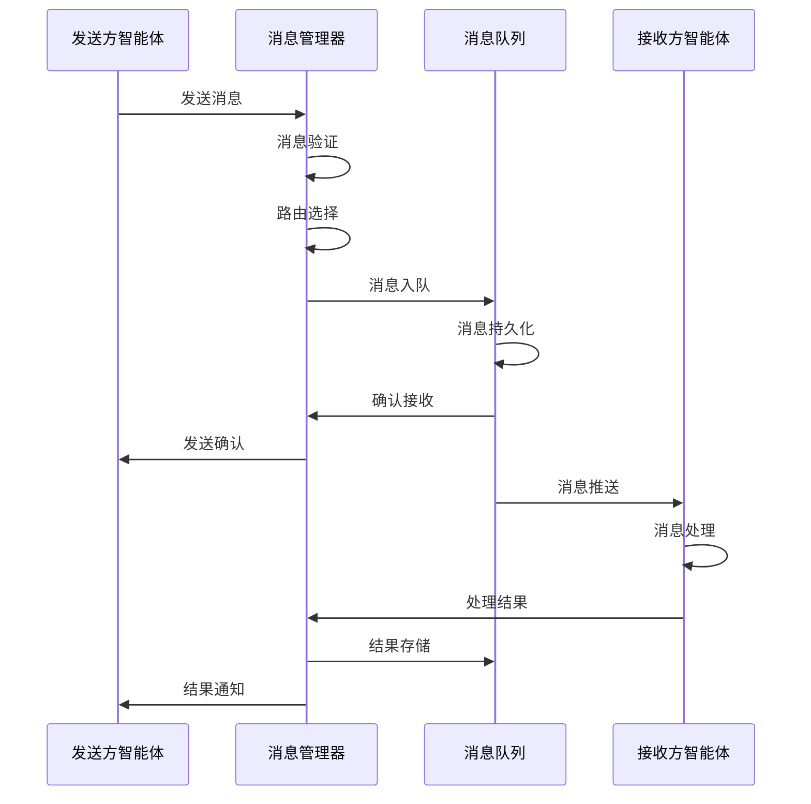
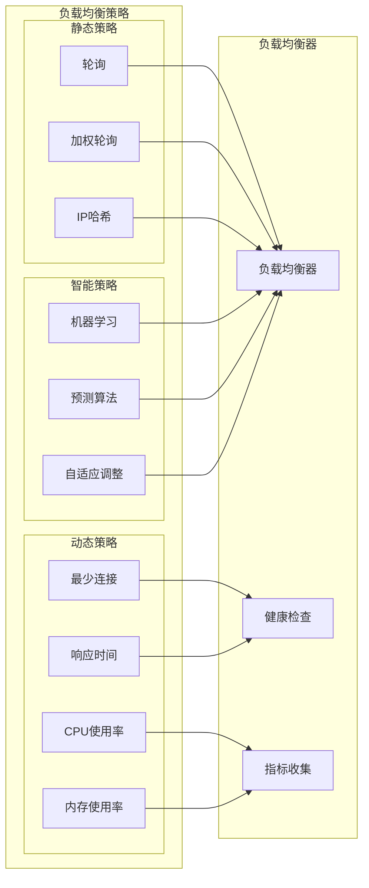
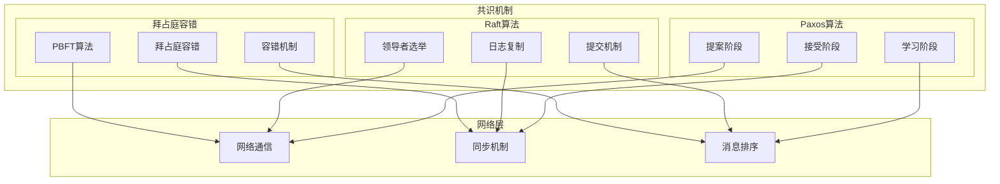
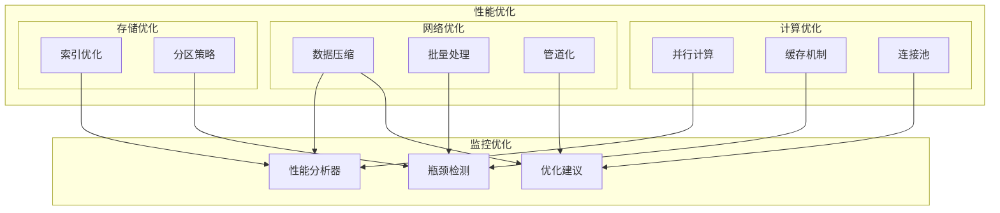

# 第3章 多智能体系统协作机制 - 架构图

## 1. 多智能体系统整体架构

## 2. 协作机制类型对比

## 3. 通信协议架构

## 4. 任务分配流程图

## 5. 协作策略架构

## 6. 容错与故障恢复架构

## 7. 消息传递机制

## 8. 负载均衡策略

## 9. 共识机制架构

## 10. 性能优化架构

这些架构图详细展示了多智能体系统协作机制的各个层面，包括协作类型、通信协议、任务分配、容错机制等关键组件。
