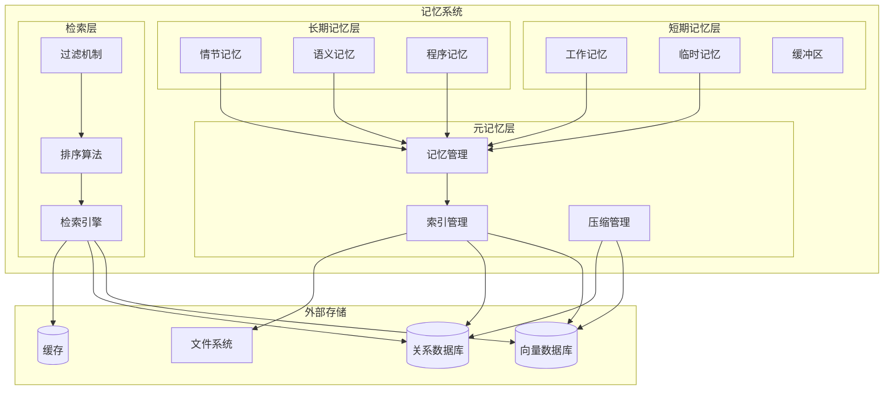
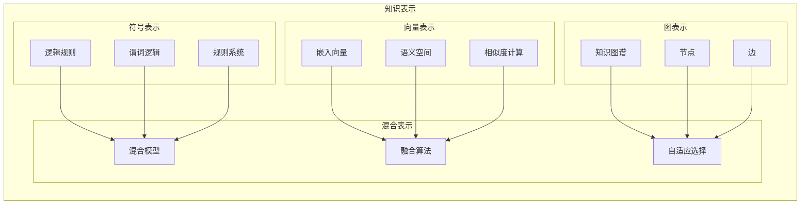
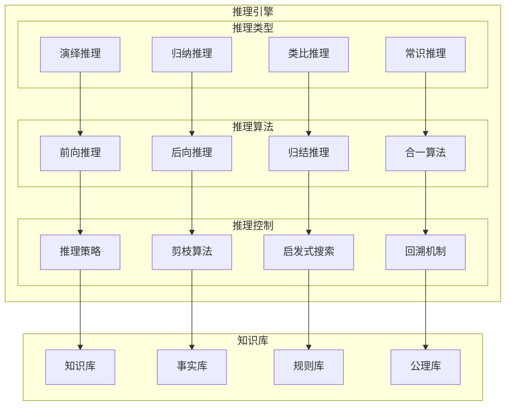
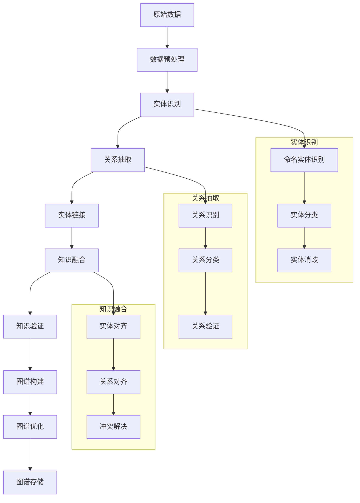
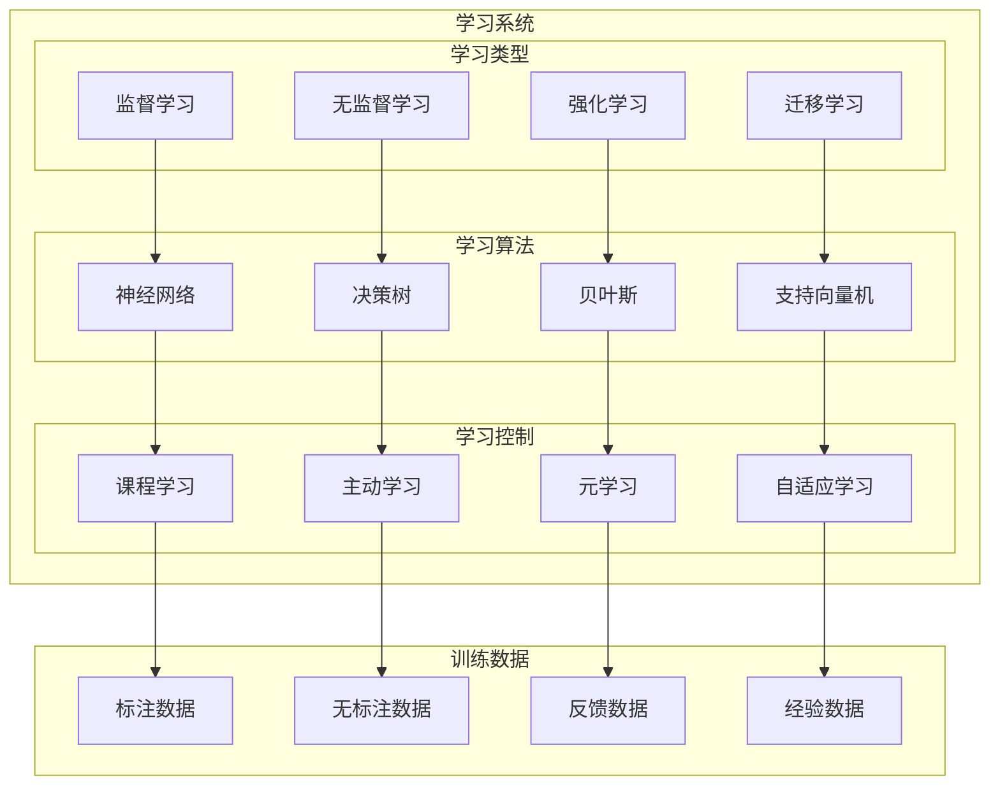
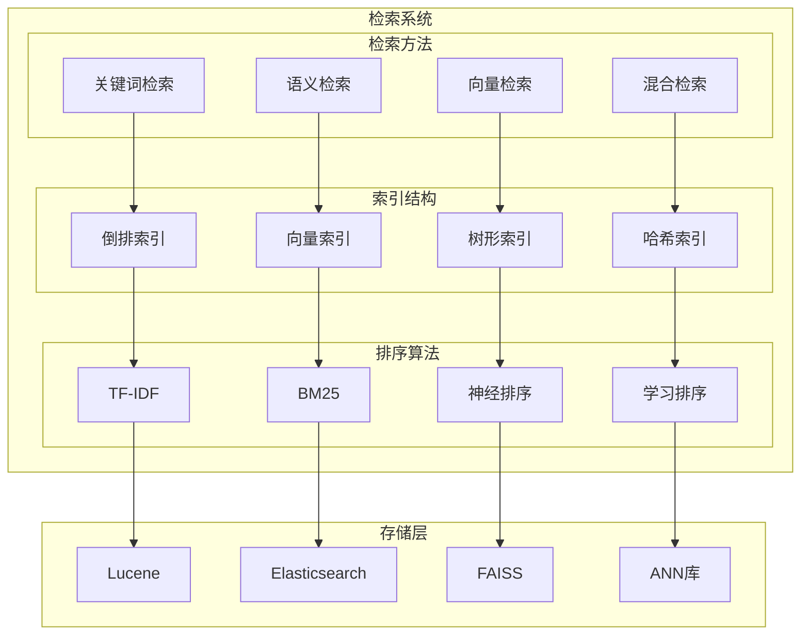
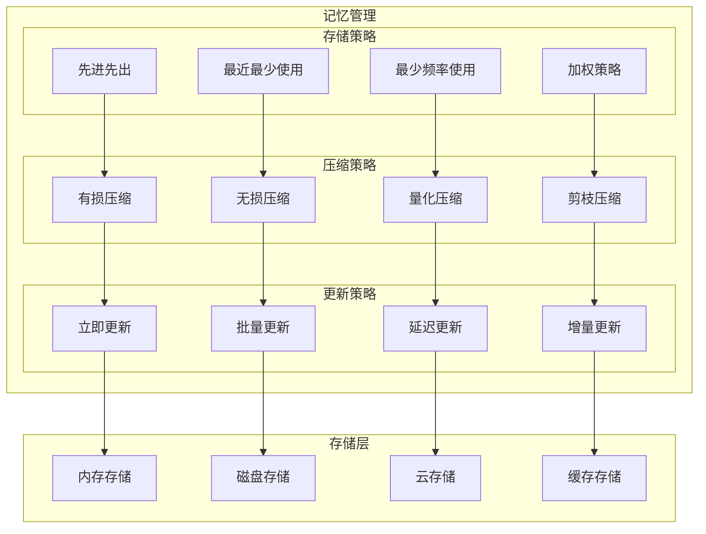
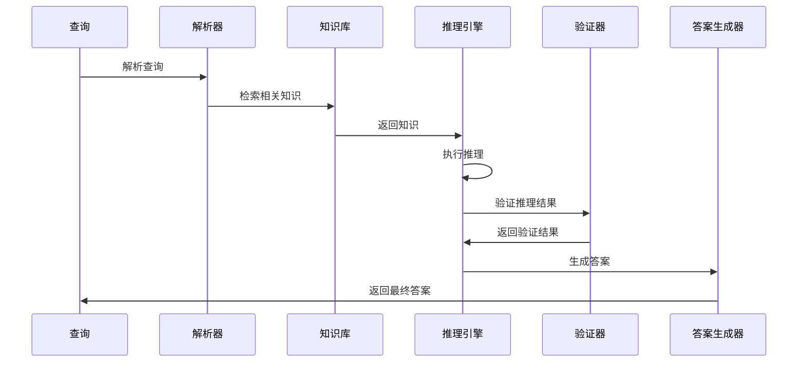
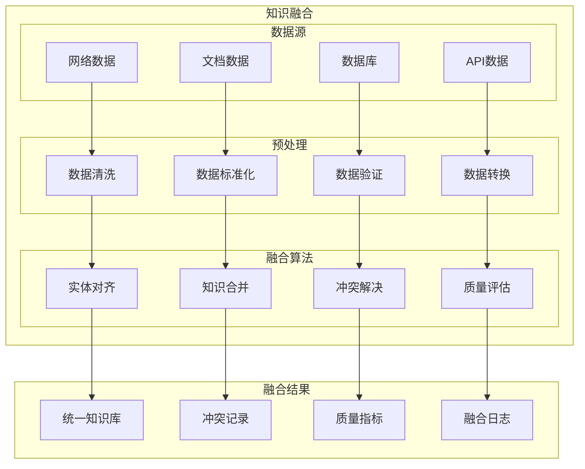
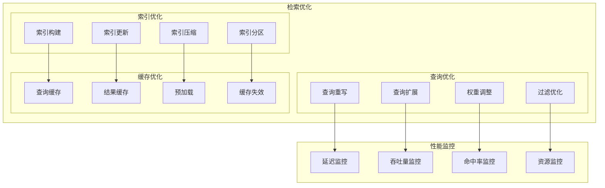

# 第4章 记忆与推理系统构建 - 架构图

## 1. 记忆系统整体架构

## 2. 知识表示方法

## 3. 推理引擎架构

## 4. 知识图谱构建流程

## 5. 学习系统架构

## 6. 检索系统架构

## 7. 记忆管理策略

## 8. 推理过程流程图

## 9. 知识融合架构

## 10. 记忆检索优化

这些架构图详细展示了记忆与推理系统的各个组件和流程，包括记忆管理、知识表示、推理引擎、学习系统等关键部分。
