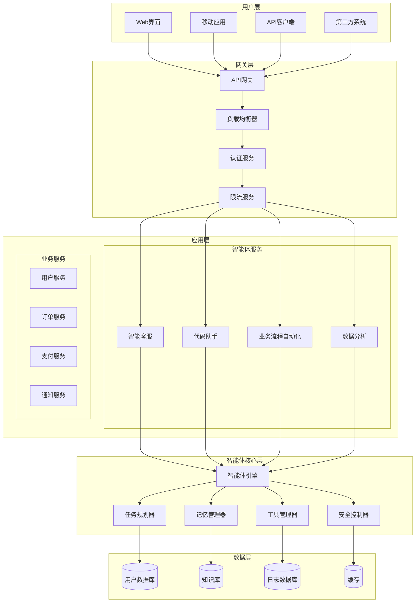
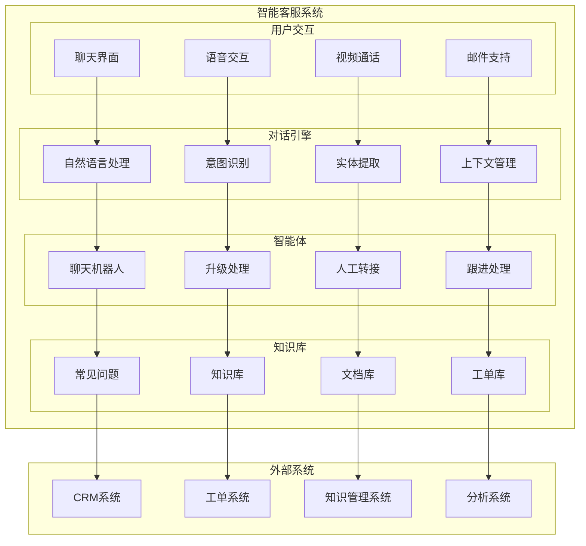
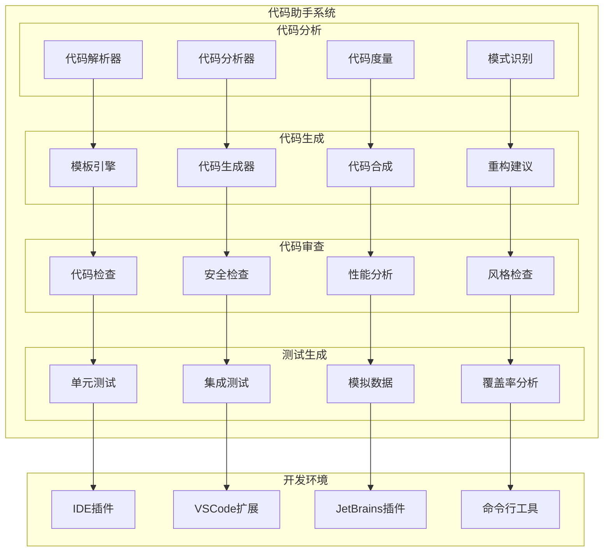
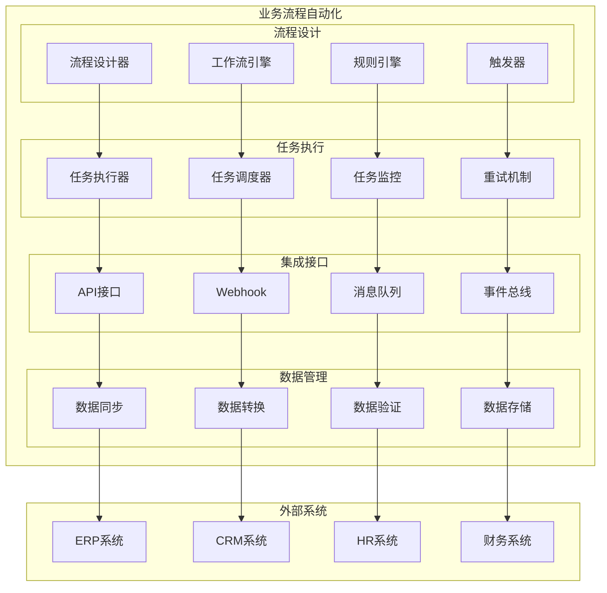
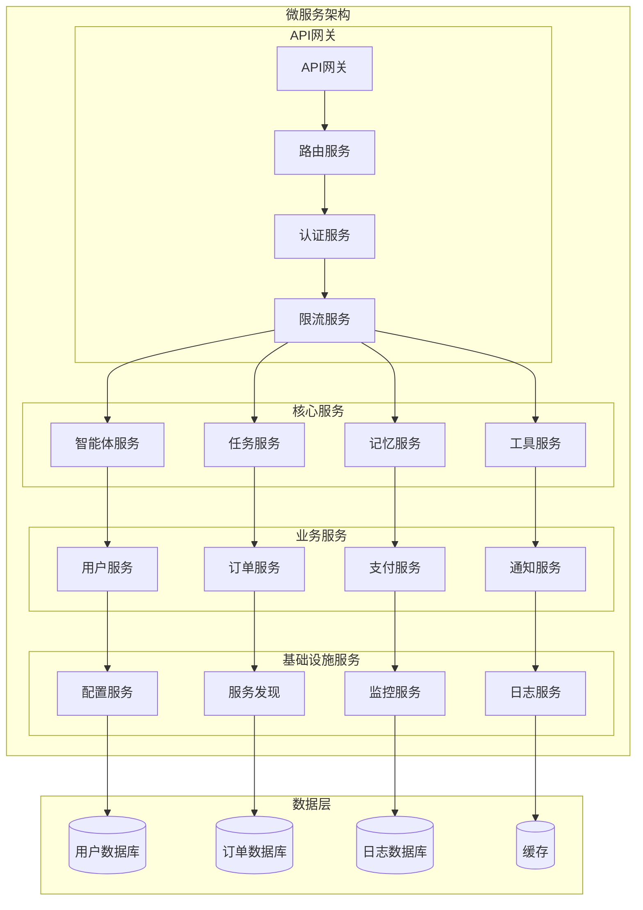
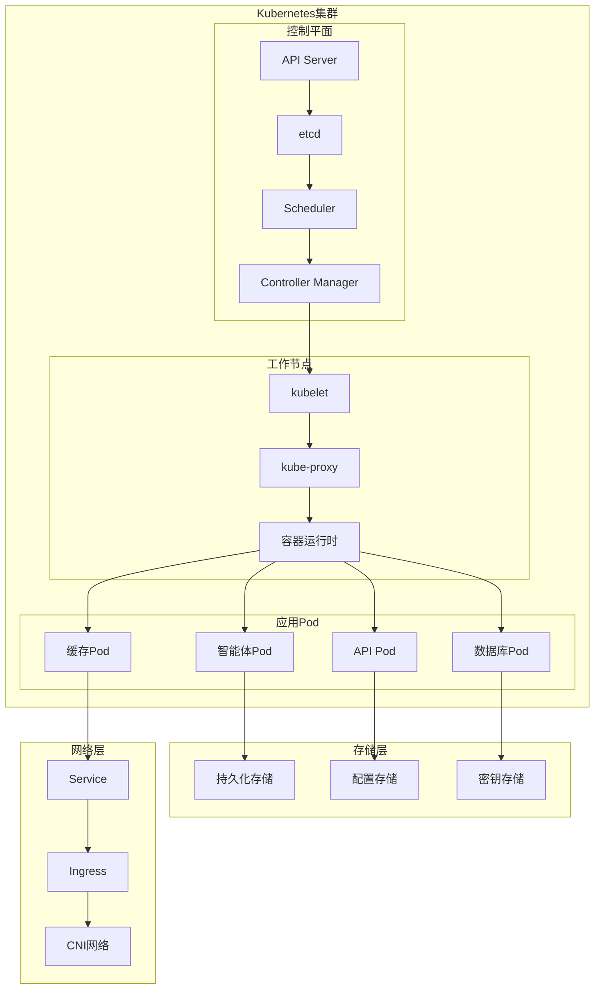
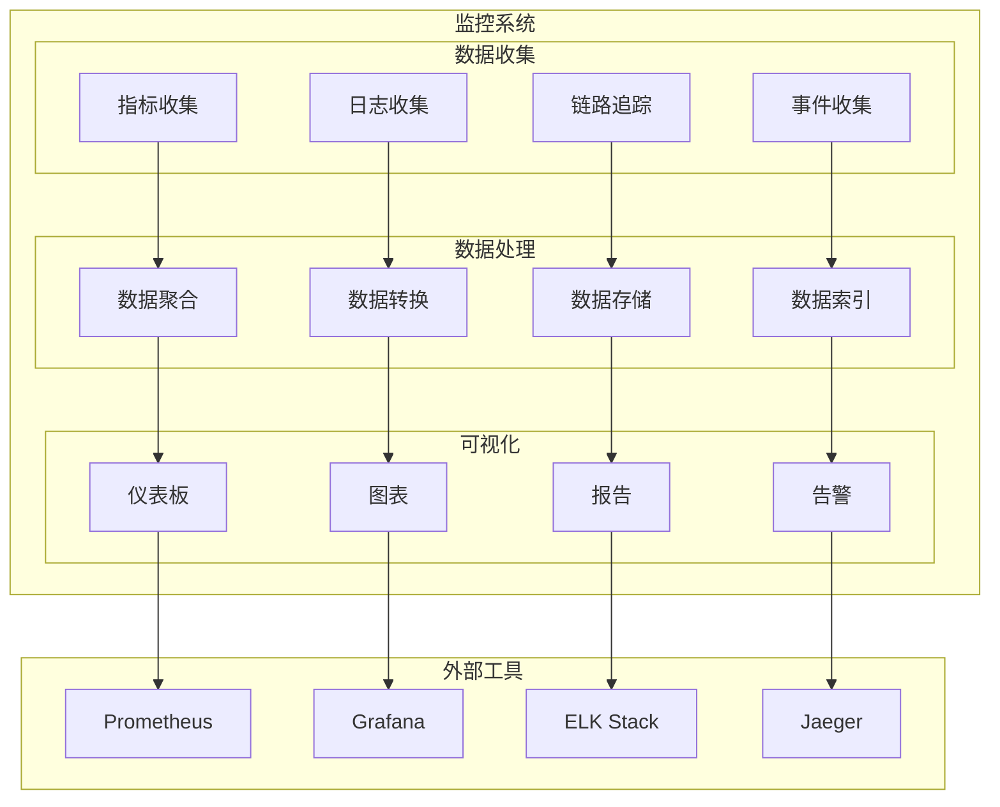
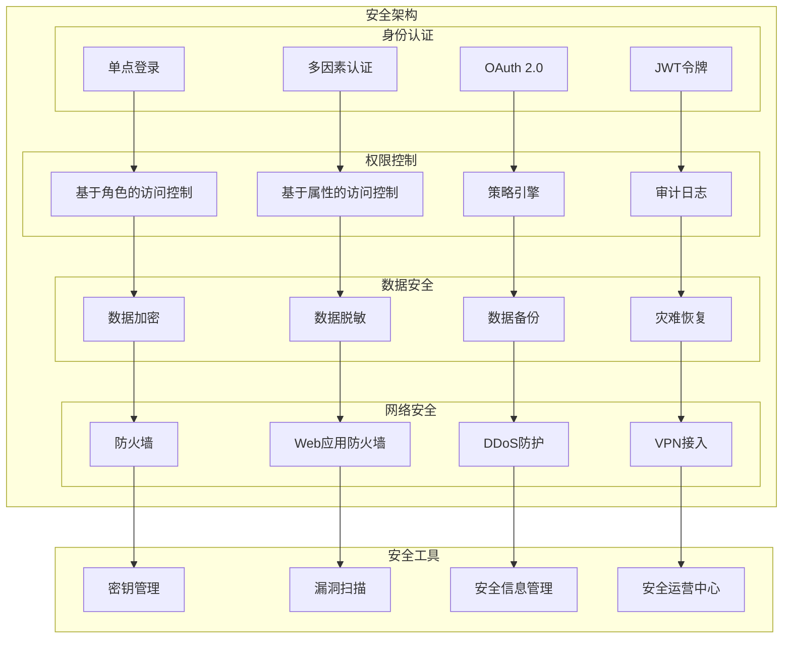
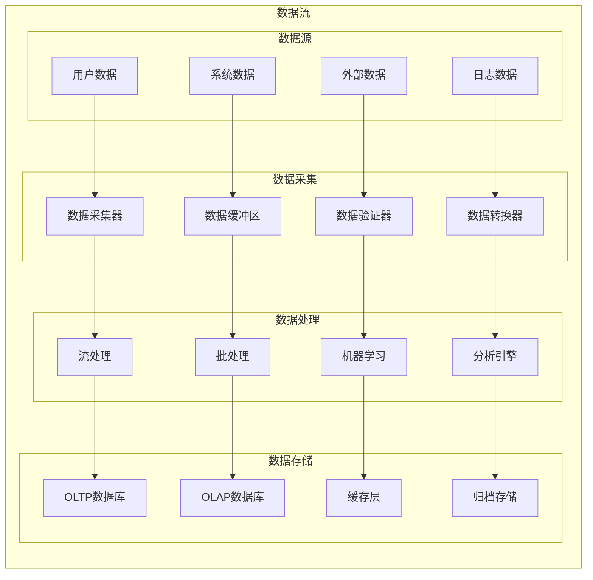
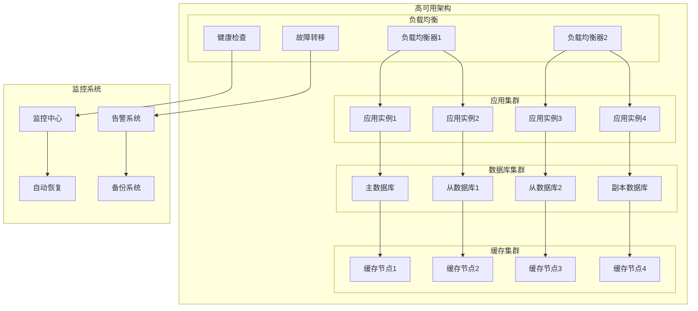

# 第6章 企业级智能体应用 - 架构图

## 1. 企业级智能体应用整体架构

## 2. 智能客服系统架构

## 3. 代码助手系统架构

## 4. 业务流程自动化架构

## 5. 微服务架构

## 6. 容器化部署架构

## 7. 监控与告警架构

## 8. 安全架构

## 9. 数据流架构

## 10. 高可用架构

这些架构图详细展示了企业级智能体应用的各个层面，包括系统架构、服务设计、部署方案、监控告警等关键组件。
