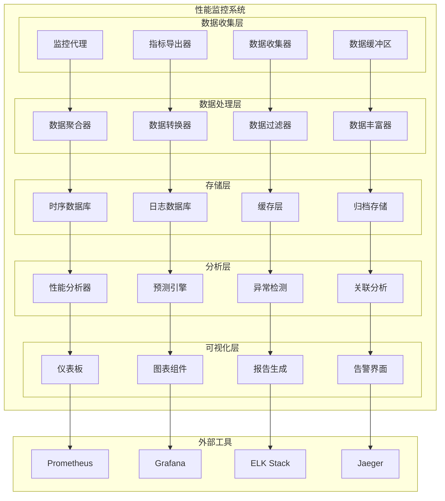
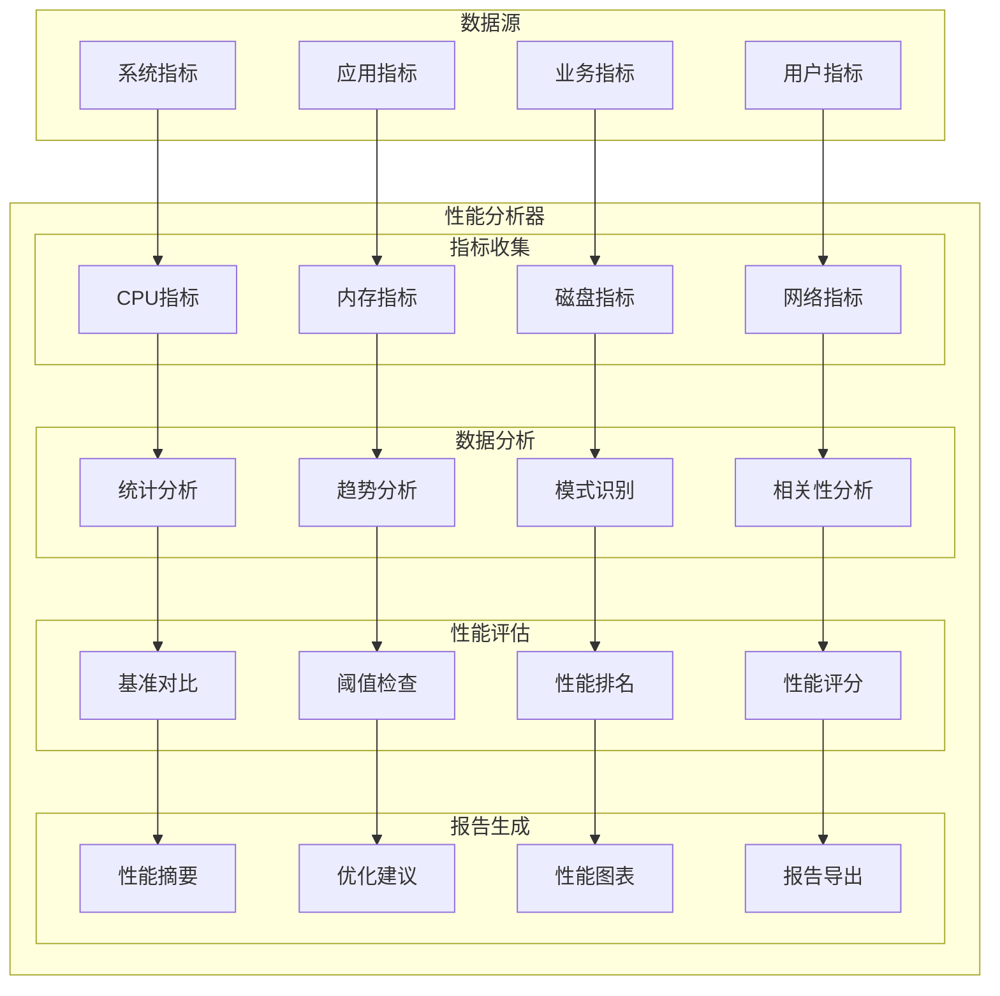
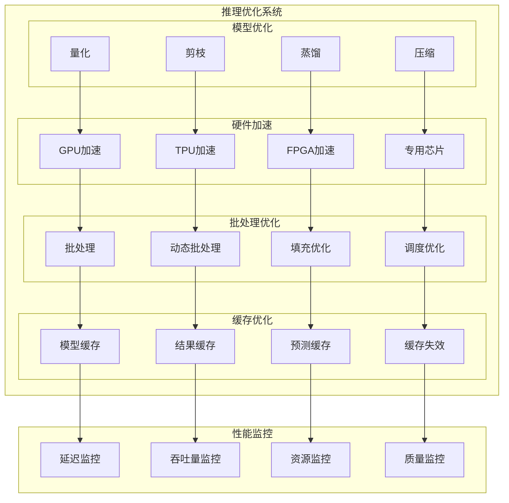
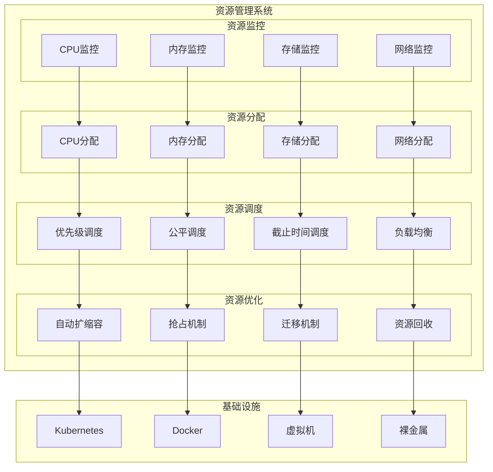
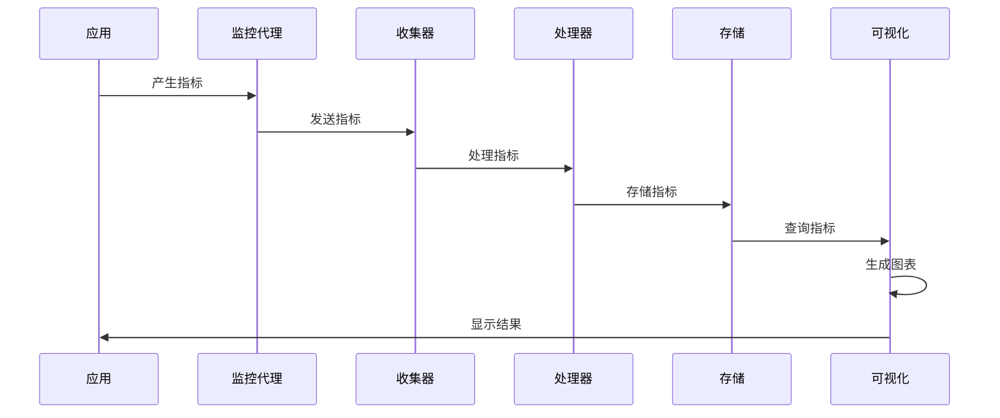
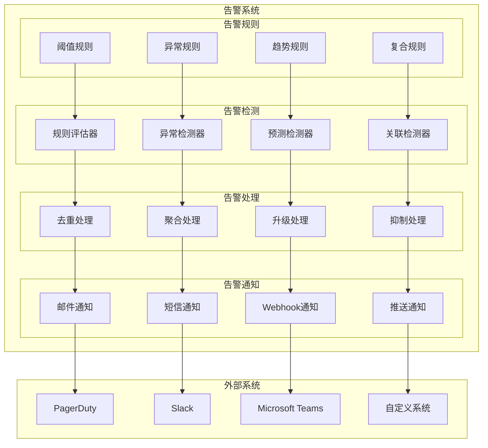
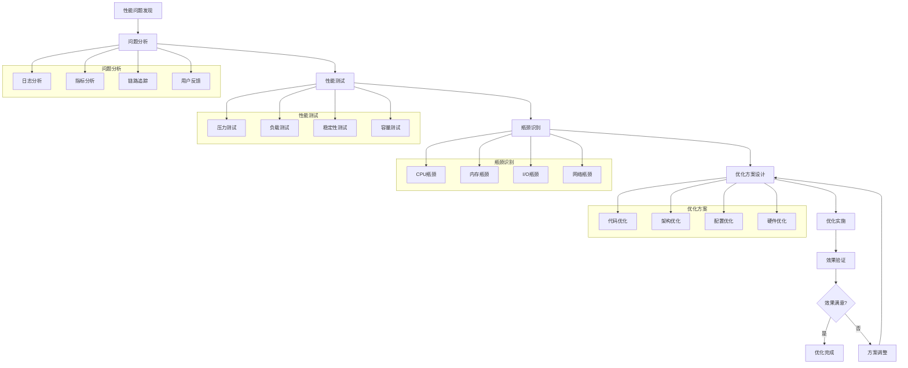
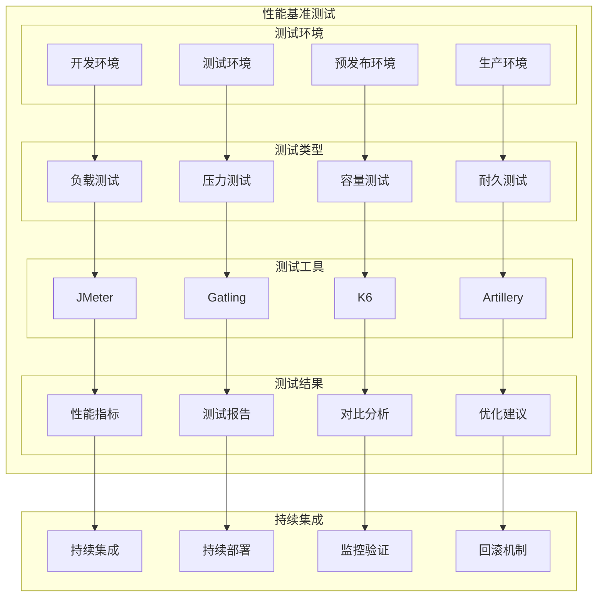

# 第8章 性能优化与监控 - 架构图

## 1. 性能监控整体架构

## 2. 性能分析器架构

## 3. 推理优化架构

## 4. 资源管理架构

## 5. 监控数据流

## 6. 告警系统架构

## 7. 性能调优流程

## 8. 监控指标分类

```mermaid
graph TB
    subgraph "监控指标"
        subgraph "系统指标"
            CPU[CPU使用率]
            MEMORY[内存使用率]
            DISK[磁盘使用率]
            NETWORK[网络使用率]
        end
        
        subgraph "应用指标"
            REQUEST[请求数]
            RESPONSE[响应时间]
            ERROR[错误率]
            THROUGHPUT[吞吐量]
        end
        
        subgraph "业务指标"
            USER[用户数]
            ORDER[订单数]
            REVENUE[收入]
            CONVERSION[转化率]
        end
        
        subgraph "自定义指标"
            CUSTOM1[自定义指标1]
            CUSTOM2[自定义指标2]
            CUSTOM3[自定义指标3]
            CUSTOM4[自定义指标4]
        end
    end
    
    subgraph "指标处理"
        COLLECT[指标收集]
        AGGREGATE[指标聚合]
        STORE[指标存储]
        QUERY[指标查询]
    end
    
    CPU --> COLLECT
    MEMORY --> COLLECT
    DISK --> COLLECT
    NETWORK --> COLLECT
    
    REQUEST --> AGGREGATE
    RESPONSE --> AGGREGATE
    ERROR --> AGGREGATE
    THROUGHPUT --> AGGREGATE
    
    USER --> STORE
    ORDER --> STORE
    REVENUE --> STORE
    CONVERSION --> STORE
    
    CUSTOM1 --> QUERY
    CUSTOM2 --> QUERY
    CUSTOM3 --> QUERY
    CUSTOM4 --> QUERY
```

## 9. 性能基准测试

## 10. 性能优化策略

```mermaid
graph TB
    subgraph "性能优化策略"
        subgraph "代码优化"
            ALGORITHM[算法优化]
            DATASTRUCT[数据结构优化]
            CACHE[缓存优化]
            ASYNC[异步优化]
        end
        
        subgraph "架构优化"
            MICROSERVICE[微服务架构]
            CQRS[CQRS模式]
            EVENT[事件驱动]
            CQRS[读写分离]
        end
        
        subgraph "数据库优化"
            INDEX[索引优化]
            QUERY[查询优化]
            PARTITION[分区优化]
            REPLICA[读写分离]
        end
        
        subgraph "网络优化"
            CDN[CDN加速]
            COMPRESS[数据压缩]
            PIPE[管道化]
            KEEPALIVE[连接复用]
        end
    end
    
    subgraph "监控验证"
        BASELINE[基准测试]
        BENCHMARK[性能基准]
        COMPARISON[对比分析]
        VALIDATION[效果验证]
    end
    
    ALGORITHM --> BASELINE
    DATASTRUCT --> BENCHMARK
    CACHE --> COMPARISON
    ASYNC --> VALIDATION
    
    MICROSERVICE --> BASELINE
    CQRS --> BENCHMARK
    EVENT --> COMPARISON
    CQRS --> VALIDATION
    
    INDEX --> BASELINE
    QUERY --> BENCHMARK
    PARTITION --> COMPARISON
    REPLICA --> VALIDATION
    
    CDN --> BASELINE
    COMPRESS --> BENCHMARK
    PIPE --> COMPARISON
    KEEPALIVE --> VALIDATION
```

这些架构图详细展示了性能优化与监控系统的各个组件和流程，包括监控架构、性能分析、推理优化、资源管理等关键部分。
