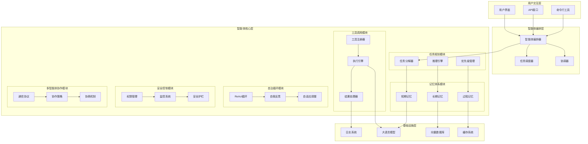
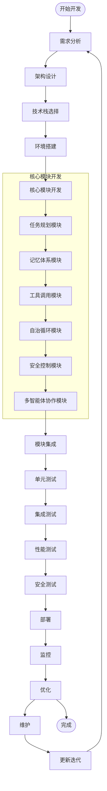
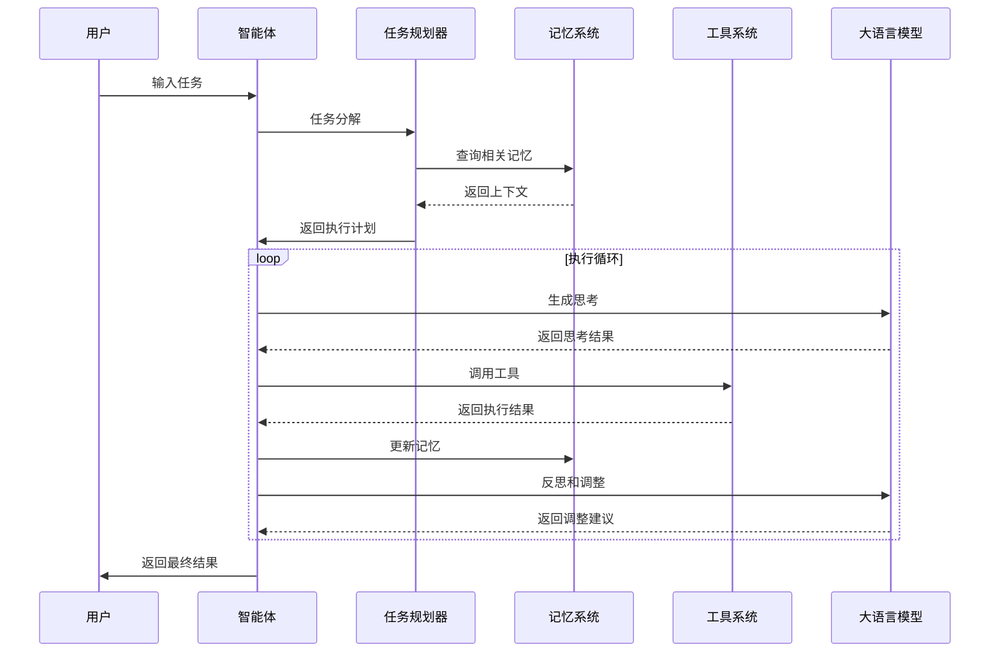
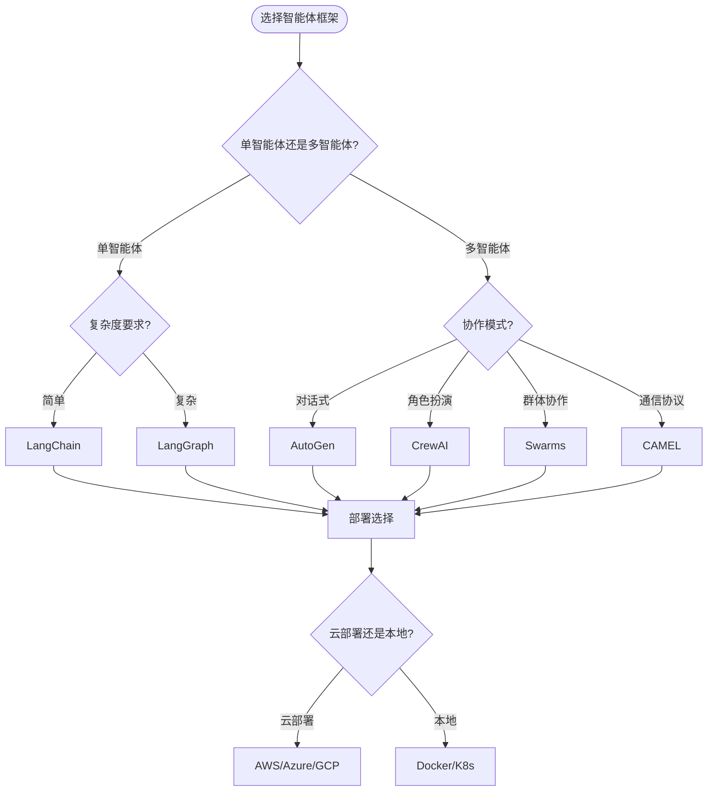

# 智能体开发模板与架构指南

> 基于30个开源智能体框架的深度分析，为智能体开发提供完整的架构模板和最佳实践

## 📋 目录

1. [智能体架构概览](#智能体架构概览)
2. [核心组件架构图](#核心组件架构图)
3. [智能体开发流程图](#智能体开发流程图)
4. [技术栈选择指南](#技术栈选择指南)
5. [开发模板代码](#开发模板代码)
6. [部署与监控](#部署与监控)
7. [最佳实践总结](#最佳实践总结)

---

## 智能体架构概览

### 🏗️ 智能体系统架构层次



---

## 核心组件架构图

### 🧠 智能体核心架构

```mermaid
graph LR
    subgraph "智能体核心"
        subgraph "输入处理"
            INPUT[用户输入]
            PARSE[输入解析]
            VALIDATE[输入验证]
        end
        
        subgraph "任务规划引擎"
            DECOMPOSE[任务分解]
            REASONING[推理规划]
            SCHEDULING[任务调度]
        end
        
        subgraph "记忆管理"
            CONTEXT[上下文记忆]
            KNOWLEDGE[知识库]
            HISTORY[历史记录]
        end
        
        subgraph "工具执行"
            TOOL_SELECT[工具选择]
            TOOL_CALL[工具调用]
            RESULT_PROCESS[结果处理]
        end
        
        subgraph "决策循环"
            THINK[思考阶段]
            ACT[行动阶段]
            OBSERVE[观察阶段]
            REFLECT[反思阶段]
        end
        
        subgraph "输出生成"
            RESPONSE[响应生成]
            FORMAT[格式化]
            DELIVERY[输出交付]
        end
    end
    
    INPUT --> PARSE
    PARSE --> VALIDATE
    VALIDATE --> DECOMPOSE
    
    DECOMPOSE --> REASONING
    REASONING --> SCHEDULING
    
    SCHEDULING --> CONTEXT
    CONTEXT --> KNOWLEDGE
    KNOWLEDGE --> HISTORY
    
    HISTORY --> TOOL_SELECT
    TOOL_SELECT --> TOOL_CALL
    TOOL_CALL --> RESULT_PROCESS
    
    RESULT_PROCESS --> THINK
    THINK --> ACT
    ACT --> OBSERVE
    OBSERVE --> REFLECT
    
    REFLECT --> RESPONSE
    RESPONSE --> FORMAT
    FORMAT --> DELIVERY
```



---

## 智能体开发流程图

### 🔄 智能体开发生命周期



### 🎯 智能体执行流程图



---

## 技术栈选择指南

### 🛠️ 技术栈矩阵

| 组件 | 推荐技术栈 | 备选方案 | 适用场景 |
|------|------------|----------|----------|
| **前端框架** | React/Vue | Angular/Svelte | 可视化智能体界面 |
| **后端框架** | FastAPI/Flask | Django/Express | API服务开发 |
| **AI框架** | LangChain/LangGraph | LlamaIndex/Semantic Kernel | 智能体编排 |
| **多智能体** | CrewAI/AutoGen | CAMEL/Swarms | 多智能体协作 |
| **数据库** | PostgreSQL/MongoDB | Redis/Chroma | 数据存储 |
| **向量数据库** | Pinecone/Weaviate | Qdrant/Milvus | 向量搜索 |
| **消息队列** | Redis/RabbitMQ | Apache Kafka | 异步通信 |
| **监控** | Prometheus/Grafana | ELK Stack | 系统监控 |
| **部署** | Docker/Kubernetes | Docker Compose | 容器化部署 |

### 📊 框架选择决策树



---

## 开发模板代码

### 🐍 Python智能体基础模板

```python
# agent_template.py
from typing import Dict, List, Any, Optional
from abc import ABC, abstractmethod
import asyncio
import logging
from dataclasses import dataclass
from enum import Enum

# 配置日志
logging.basicConfig(level=logging.INFO)
logger = logging.getLogger(__name__)

class AgentState(Enum):
    IDLE = "idle"
    THINKING = "thinking"
    ACTING = "acting"
    OBSERVING = "observing"
    REFLECTING = "reflecting"

@dataclass
class Task:
    id: str
    description: str
    priority: int
    status: str
    context: Dict[str, Any]

@dataclass
class Memory:
    short_term: Dict[str, Any]
    long_term: Dict[str, Any]
    process: List[Dict[str, Any]]

class Tool(ABC):
    """工具基类"""
    
    @abstractmethod
    async def execute(self, **kwargs) -> Any:
        pass
    
    @property
    @abstractmethod
    def name(self) -> str:
        pass

class TaskPlanner:
    """任务规划器"""
    
    def __init__(self):
        self.tasks = []
    
    async def decompose_task(self, task_description: str) -> List[Task]:
        """任务分解"""
        # 实现任务分解逻辑
        pass
    
    async def prioritize_tasks(self, tasks: List[Task]) -> List[Task]:
        """任务优先级排序"""
        return sorted(tasks, key=lambda x: x.priority, reverse=True)

class MemoryManager:
    """记忆管理器"""
    
    def __init__(self):
        self.memory = Memory(
            short_term={},
            long_term={},
            process=[]
        )
    
    async def store_short_term(self, key: str, value: Any):
        """存储短期记忆"""
        self.memory.short_term[key] = value
    
    async def store_long_term(self, key: str, value: Any):
        """存储长期记忆"""
        self.memory.long_term[key] = value
    
    async def store_process(self, step: Dict[str, Any]):
        """存储过程记忆"""
        self.memory.process.append(step)

class ToolManager:
    """工具管理器"""
    
    def __init__(self):
        self.tools: Dict[str, Tool] = {}
    
    def register_tool(self, tool: Tool):
        """注册工具"""
        self.tools[tool.name] = tool
    
    async def execute_tool(self, tool_name: str, **kwargs) -> Any:
        """执行工具"""
        if tool_name not in self.tools:
            raise ValueError(f"Tool {tool_name} not found")
        return await self.tools[tool_name].execute(**kwargs)

class Agent:
    """智能体核心类"""
    
    def __init__(self, name: str):
        self.name = name
        self.state = AgentState.IDLE
        self.task_planner = TaskPlanner()
        self.memory_manager = MemoryManager()
        self.tool_manager = ToolManager()
        self.current_task: Optional[Task] = None
    
    async def think(self, input_data: str) -> str:
        """思考阶段"""
        self.state = AgentState.THINKING
        logger.info(f"{self.name} is thinking...")
        
        # 实现思考逻辑
        thoughts = f"Processing: {input_data}"
        await self.memory_manager.store_short_term("current_thoughts", thoughts)
        
        return thoughts
    
    async def act(self, action: str, **kwargs) -> Any:
        """行动阶段"""
        self.state = AgentState.ACTING
        logger.info(f"{self.name} is acting: {action}")
        
        # 执行工具调用
        result = await self.tool_manager.execute_tool(action, **kwargs)
        
        # 记录过程
        await self.memory_manager.store_process({
            "action": action,
            "kwargs": kwargs,
            "result": result,
            "timestamp": asyncio.get_event_loop().time()
        })
        
        return result
    
    async def observe(self, result: Any) -> str:
        """观察阶段"""
        self.state = AgentState.OBSERVING
        logger.info(f"{self.name} is observing result...")
        
        # 分析结果
        observation = f"Observed result: {result}"
        await self.memory_manager.store_short_term("last_observation", observation)
        
        return observation
    
    async def reflect(self, observation: str) -> str:
        """反思阶段"""
        self.state = AgentState.REFLECTING
        logger.info(f"{self.name} is reflecting...")
        
        # 反思和调整
        reflection = f"Reflection on: {observation}"
        await self.memory_manager.store_long_term("reflection", reflection)
        
        return reflection
    
    async def react_loop(self, input_data: str) -> str:
        """ReAct循环"""
        logger.info(f"{self.name} starting ReAct loop with: {input_data}")
        
        # 思考
        thoughts = await self.think(input_data)
        
        # 行动
        action_result = await self.act("process_input", data=input_data)
        
        # 观察
        observation = await self.observe(action_result)
        
        # 反思
        reflection = await self.reflect(observation)
        
        self.state = AgentState.IDLE
        return f"Processed: {input_data} -> {action_result}"

# 示例工具实现
class CalculatorTool(Tool):
    """计算器工具"""
    
    @property
    def name(self) -> str:
        return "calculator"
    
    async def execute(self, operation: str, **kwargs) -> float:
        """执行计算"""
        try:
            result = eval(operation)
            return float(result)
        except Exception as e:
            raise ValueError(f"Invalid operation: {operation}, Error: {e}")

# 使用示例
async def main():
    # 创建智能体
    agent = Agent("MyAgent")
    
    # 注册工具
    calculator = CalculatorTool()
    agent.tool_manager.register_tool(calculator)
    
    # 执行任务
    result = await agent.react_loop("Calculate 2 + 2")
    print(f"Result: {result}")

if __name__ == "__main__":
    asyncio.run(main())
```

### 🔧 配置文件模板

```yaml
# config.yaml
agent:
  name: "MyAgent"
  version: "1.0.0"
  description: "A sample AI agent"

memory:
  short_term:
    max_size: 1000
    ttl: 3600  # seconds
  long_term:
    storage_type: "vector_db"
    collection_name: "agent_memory"
  process:
    max_steps: 100

tools:
  - name: "calculator"
    type: "builtin"
    enabled: true
  - name: "web_search"
    type: "external"
    enabled: true
    api_key: "${WEB_SEARCH_API_KEY}"

llm:
  provider: "openai"
  model: "gpt-4"
  temperature: 0.7
  max_tokens: 2000

security:
  max_iterations: 10
  timeout: 300  # seconds
  rate_limit: 100  # requests per minute

monitoring:
  enabled: true
  log_level: "INFO"
  metrics_endpoint: "http://localhost:9090/metrics"
```

### 🐳 Docker配置模板

```dockerfile
# Dockerfile
FROM python:3.11-slim

WORKDIR /app

# 安装系统依赖
RUN apt-get update && apt-get install -y \
    gcc \
    g++ \
    && rm -rf /var/lib/apt/lists/*

# 复制依赖文件
COPY requirements.txt .

# 安装Python依赖
RUN pip install --no-cache-dir -r requirements.txt

# 复制应用代码
COPY . .

# 设置环境变量
ENV PYTHONPATH=/app
ENV PYTHONUNBUFFERED=1

# 暴露端口
EXPOSE 8000

# 启动命令
CMD ["python", "main.py"]
```

```yaml
# docker-compose.yml
version: '3.8'

services:
  agent:
    build: .
    ports:
      - "8000:8000"
    environment:
      - OPENAI_API_KEY=${OPENAI_API_KEY}
      - DATABASE_URL=${DATABASE_URL}
    volumes:
      - ./data:/app/data
    depends_on:
      - redis
      - postgres

  redis:
    image: redis:7-alpine
    ports:
      - "6379:6379"
    volumes:
      - redis_data:/data

  postgres:
    image: postgres:15-alpine
    environment:
      - POSTGRES_DB=agent_db
      - POSTGRES_USER=agent
      - POSTGRES_PASSWORD=${POSTGRES_PASSWORD}
    ports:
      - "5432:5432"
    volumes:
      - postgres_data:/var/lib/postgresql/data

  monitoring:
    image: prom/prometheus
    ports:
      - "9090:9090"
    volumes:
      - ./monitoring/prometheus.yml:/etc/prometheus/prometheus.yml

volumes:
  redis_data:
  postgres_data:
```

---

## 部署与监控

### 📊 监控指标

```python
# monitoring.py
from prometheus_client import Counter, Histogram, Gauge, start_http_server
import time

# 定义监控指标
agent_requests_total = Counter('agent_requests_total', 'Total agent requests', ['agent_name'])
agent_request_duration = Histogram('agent_request_duration_seconds', 'Agent request duration')
agent_memory_usage = Gauge('agent_memory_usage_bytes', 'Agent memory usage')
agent_active_tasks = Gauge('agent_active_tasks', 'Number of active tasks')

class AgentMonitor:
    """智能体监控器"""
    
    def __init__(self, agent_name: str):
        self.agent_name = agent_name
    
    def record_request(self, duration: float):
        """记录请求"""
        agent_requests_total.labels(agent_name=self.agent_name).inc()
        agent_request_duration.observe(duration)
    
    def update_memory_usage(self, usage: int):
        """更新内存使用量"""
        agent_memory_usage.set(usage)
    
    def update_active_tasks(self, count: int):
        """更新活跃任务数"""
        agent_active_tasks.set(count)
```

### 🔍 日志配置

```python
# logging_config.py
import logging
import logging.config
import json
from datetime import datetime

LOGGING_CONFIG = {
    "version": 1,
    "disable_existing_loggers": False,
    "formatters": {
        "standard": {
            "format": "%(asctime)s [%(levelname)s] %(name)s: %(message)s"
        },
        "json": {
            "format": "%(asctime)s",
            "class": "pythonjsonlogger.jsonlogger.JsonFormatter"
        }
    },
    "handlers": {
        "default": {
            "level": "INFO",
            "formatter": "standard",
            "class": "logging.StreamHandler",
            "stream": "ext://sys.stdout"
        },
        "file": {
            "level": "DEBUG",
            "formatter": "json",
            "class": "logging.handlers.RotatingFileHandler",
            "filename": "logs/agent.log",
            "maxBytes": 10485760,  # 10MB
            "backupCount": 5
        }
    },
    "loggers": {
        "": {
            "handlers": ["default", "file"],
            "level": "DEBUG",
            "propagate": False
        }
    }
}

def setup_logging():
    """设置日志配置"""
    logging.config.dictConfig(LOGGING_CONFIG)
```

---

## 最佳实践总结

### ✅ 开发最佳实践

1. **模块化设计**
   - 将智能体功能拆分为独立模块
   - 使用接口和抽象类定义标准
   - 保持模块间的松耦合

2. **错误处理**
   - 实现完善的异常处理机制
   - 提供优雅的降级策略
   - 记录详细的错误日志

3. **性能优化**
   - 使用异步编程提高并发性能
   - 实现缓存机制减少重复计算
   - 监控和优化内存使用

4. **安全考虑**
   - 实现输入验证和清理
   - 设置执行超时和资源限制
   - 使用安全的API调用方式

5. **测试策略**
   - 编写单元测试覆盖核心功能
   - 实现集成测试验证模块协作
   - 进行性能测试确保系统稳定性

### 🚀 部署最佳实践

1. **容器化部署**
   - 使用Docker进行应用容器化
   - 使用Kubernetes进行容器编排
   - 实现健康检查和自动重启

2. **监控和日志**
   - 集成Prometheus和Grafana监控
   - 实现结构化日志记录
   - 设置告警机制

3. **配置管理**
   - 使用环境变量管理配置
   - 实现配置热更新
   - 分离敏感信息

4. **扩展性设计**
   - 支持水平扩展
   - 实现负载均衡
   - 使用消息队列解耦

### 📈 性能优化建议

1. **内存管理**
   - 定期清理短期记忆
   - 使用内存映射文件存储大对象
   - 实现内存使用监控

2. **并发处理**
   - 使用异步I/O操作
   - 实现任务队列处理
   - 合理设置并发限制

3. **缓存策略**
   - 缓存频繁访问的数据
   - 实现智能缓存失效
   - 使用分布式缓存

---

## 🎯 总结

本模板基于对30个开源智能体框架的深度分析，提供了完整的智能体开发架构和最佳实践。通过遵循这个模板，您可以：

1. **快速启动**：使用提供的代码模板快速搭建智能体项目
2. **标准化开发**：遵循统一的架构模式和开发规范
3. **高效部署**：使用容器化和监控方案确保系统稳定性
4. **持续优化**：基于监控数据进行性能优化和功能迭代

选择适合您需求的技术栈，按照模板进行开发，您将能够构建出高质量、可扩展的智能体系统。

---

*本模板基于开源智能体项目分析报告，持续更新中。如有问题或建议，欢迎反馈。*
